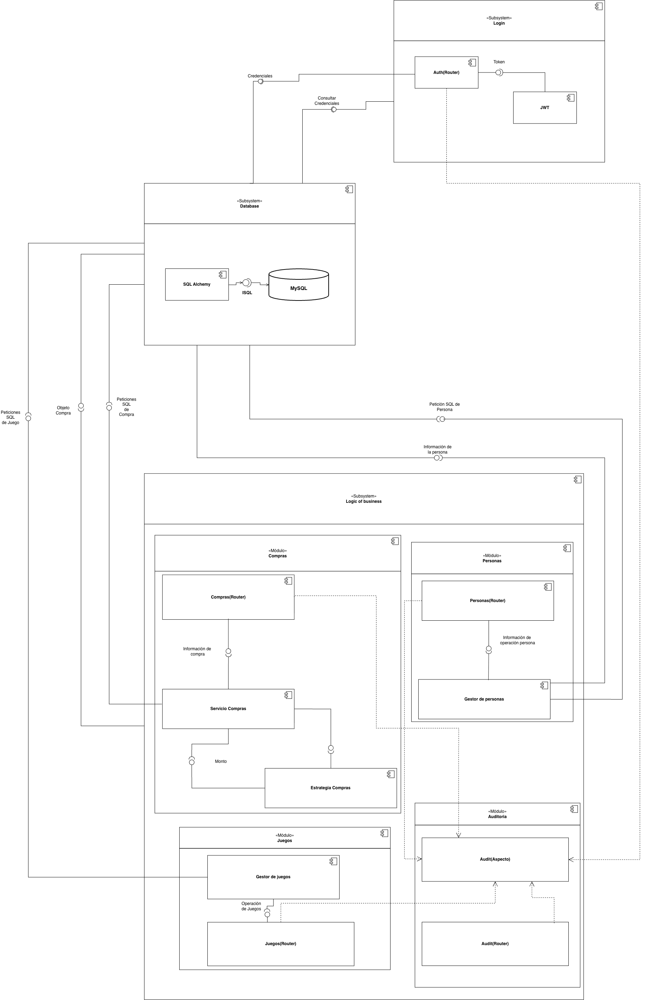
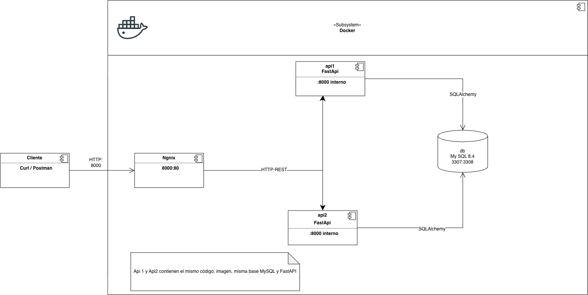

# UT3_TFU - Sistema de Juegos (ADAII)

API REST de juegos construida con **FastAPI**, **SQLAlchemy** y **MySQL**, desplegada en **Docker** con balanceo de carga. Este README explica la estructura del sistema tal como se modela en el diagrama de componentes, y mapea cada elemento del diagrama con el código real del proyecto.

---

## 1. Visión general

El sistema gestiona personas, juegos, géneros y compras, con autenticación **JWT**, auditoría de operaciones y una política de costo de compra configurable (patrón **Strategy**).

Stack:

| Capa | Tecnología |
|------|-----------|
| API | Python 3.12 + FastAPI + Uvicorn |
| ORM | SQLAlchemy (PyMySQL) |
| Base de datos | MySQL 8.4 |
| Autenticación | PyJWT (HS256) + bcrypt |
| Despliegue | Docker Compose + Nginx (balanceador) |

---

## 2. Estructura del diagrama de componentes

El archivo tiene **2 páginas**. Como **todo el sistema corre dentro de contenedores Docker**, se realizaron dos diagramas separados por dimensiones del trabajo, para poder entender mejor el trabajo:

1. **Main | Diagrama de Componentes** - componentes lógicos de la aplicación (subsistemas, módulos y sus relaciones).
2. **Docker | Diagrama de Componentes** - despliegue físico de esos componentes en contenedores (qué imagen, qué puerto, cómo se conectan entre sí).

<br>
*Diagrama 1 - Componentes lógicos (Main).*

<br>
*Diagrama 2 - Despliegue en contenedores (Docker).*

Notación UML usada:

- `«Subsystem»` / `«Módulo»` — cajas que agrupan componentes con encabezado y un "puerto" (pestaña lateral izquierda `shape=module`).
- **Círculo** (interfaz provista, ball) y **semicírculo** (interfaz requerida, socket) — conexiones "ball-and-socket"; los componentes se ensamblan encajando el círculo en el semicírculo.
- **Flecha punteada** — dependencia (se usa el componente al que apunta).
- **Cilindro** — base de datos.

### 2.1 Página 1 - Componentes lógicos

#### Subsystem: Login

| Componente | Rol |
|-----------|-----|
| **Auth(Router)** | Endpoint `POST /auth/login`: valida credenciales contra la tabla `Login` y emite un **Token** (JWT) |
| **JWT** | Emisión y verificación de tokens (módulo `security/jwt.py`) |

Flujo: `Auth(Router)` provee el token JWT → los routers del negocio lo **requieren** para autorizar peticiones (dependencia `security/dependencies.py`).

Archivos: `app/routers/auth.py`, `security/jwt.py`, `security/password.py`, `security/dependencies.py`.

#### Subsystem: Database

| Componente | Rol |
|-----------|-----|
| **SQL Alchemy** | ORM: mapea las tablas a objetos (`app/database.py`, `app/models.py`) |
| **ISQL** (interfaz) | Interfaz lógica hacia el motor; los repositorios la consumen |
| **MySQL** | Motor de base de datos (cilindro) |

Flujos etiquetados en el diagrama: *Peticiones SQL de Compra* → `ISQL` → MySQL, y *Objeto Compra* de vuelta a la lógica de negocio. Lo mismo para *Peticiones SQL de Persona* y *SQL de Juego*.

Archivos: `app/database.py`, `app/models.py`, `bd/schema.sql`.

#### Subsystem: Logic of business

Contiene los módulos de negocio y sus componentes internos:

| Módulo `«Módulo»` | Componentes | Rol |
|-------------------|-------------|-----|
| **Compras** | `Compras(Router)`, `Servicio Compras`, `Estrategia Compras` | CRUD de compras; aplica la política de costo (Strategy) |
| **Personas** | `Personas(Router)`, `Gestor de personas` | CRUD de personas y alta de credenciales |
| **Juegos** | `Juegos(Router)`, `Gestor de juegos` | CRUD de juegos y asignación de géneros |
| **Auditoria** | `Audit(Router)`, `Audit(Aspecto)` | Registra cada operación en un log (`app/aspects/audit.py`) |

Conexiones clave del diagrama:

- `Juegos(Router)` → `Audit(Aspecto)`: dependencia punteada; todo router decorado con `@auditar` dispara la auditoría.
- `Compras(Router)` → `Servicio Compras` → `Estrategia Compras` (*Calcular costo*): la estrategia calcula `costo_base` una vez creada/actualizada la `Compra`.
- `Personas(Router)` → `Gestor de personas` → emite *Información de operación persona*.
- `Servicio Compras` → `Estrategia Compras` con etiquetas *Información de compra* y *Monto*: la estrategia recibe el monto base y devuelve el costo final.

Archivos: `app/routers/compras.py`, `app/services/compras.py`, `app/strategies/costo_compra.py`, `app/routers/personas.py`, `app/routers/juegos.py`, `app/routers/audit.py`.

### 2.2 Página 2 — Despliegue Docker

| Componente | Contenedor | Detalle |
|-----------|-----------|---------|
| **Cliente** | - | Curl / Postman contra `HTTP: 8000` |
| **Ngnix** [sic] | `nginx:alpine` | Balanceador. Publica `8000:80`, delega en `fastapi_backend` (`nginx.conf`) |
| **api1** | imagen `api` | FastAPI, `:8000` interno, healthcheck |
| **api2** | imagen `api` | Mismo código/imagen que api1 (nota del diagrama) |
| **db** | `mysql:8.4` | MySQL, mapea `3307:3306` |

Conexiones:

- Cliente → Nginx (`HTTP: 8000`)
- Nginx → api1 y api2 (`HTTP-REST`)
- api1/api2 → db (`SQLAlchemy`)

Volúmenes: `mysqldata` (datos persistentes) y `audit_logs` (log compartido entre ambas instancias de auditoría).

Archivos: `docker-compose.yaml`, `nginx.conf`, `dockerfile`.

---

## 3. Modelo de datos (MySQL)

Definido en `bd/schema.sql`:

| Tabla | Descripción |
|-------|-------------|
| `Persona` | Email (PK), nombre, apellido |
| `Login` | Email (PK/FK → Persona), contraseña hasheada (bcrypt), fecha de creación |
| `Genero` | Nombre (PK), descripción |
| `Juego` | Id (PK autoincrement), nombre |
| `JuegoTieneGenero` | Relación N:M entre Juego y Genero |
| `Compra` | Email (FK) + IdJuego (FK) (PK compuesta), fecha, costo |
| `Copia` | Relación extra: registro de copia adquirida por una persona |

Las tablas se crean automáticamente al primer arranque de MySQL vía `docker-entrypoint-initdb.d` (`bd/schema.sql` → `01_schema.sql`, `bd/seed.sql` → `02_seed.sql`).

---

## 4. Decisiones de arquitectura

- **Patrón Strategy** (`app/strategies/costo_compra.py`): el costo de una compra se calcula según la política recibida (`normal` = costo base, `invierno` = 50%). `obtener_estrategia()` resuelve la estrategia; nuevas políticas solo agregan una clase al mapa `_ESTRATEGIAS`.
- **Auditoría como aspecto** (`app/aspects/audit.py`): el decorador `@auditar("OPERACION")` envuelve cada endpoint y escribe `timestamp | operacion | resultado` (OK o ERROR) en `audit_logs`. Ambas instancias api comparten el volumen `audit_logs`/`/app/logs`.
- **Autenticación JWT**: `POST /auth/login` devuelve `access_token` (HS256, expiración configurable). Las rutas `/personas`, `/juegos`, `/compras` y `/auditoria` exigen `obtener_usuario_actual` (dependencia HTTPBearer).
- **Balanceo con healthcheck**: `docker-compose.yaml` marca api1/api2 como saludables (`/health`) antes de levantar Nginx; el upstream de `nginx.conf` reparte las peticiones.
- **Rollback demostrable**: la imagen acepta `ARG FORCE_UNHEALTHY`; con `FORCE_UNHEALTHY=true` el endpoint `/health` responde 503, permitiendo probar el rediseño de una versión defectuosa.

---

## 5. Ejecución y scripts de demostración

Requisitos: Docker Desktop/Engine iniciado, Docker Compose y Python 3.12+.

Abrir una terminal en la carpeta del proyecto y ejecutar el menú:

**Windows - PowerShell:**

```powershell
.\run.ps1
```

Si PowerShell bloquea la ejecución de scripts:

```powershell
Set-ExecutionPolicy -Scope Process -ExecutionPolicy Bypass
.\run.ps1
```

Este permiso aplica únicamente a la ventana actual de PowerShell.

**Linux/macOS - Bash:**

```bash
bash run.sh
```

La configuración `.env` se crea automáticamente si no existe. El primer inicio puede tardar varios minutos mientras se descargan y construyen las imágenes.

### Opciones del menú

Los scripts están en `scripts/`, con versiones `.ps1` para PowerShell y `.sh` para Bash.

| Opción | Script | Qué comprueba |
|---|---|---|
| 1 - Iniciar entorno | `start` | Construye la imagen, inicia los cuatro servicios y verifica su disponibilidad. |
| 2 - Ver estado | `status` | Muestra los contenedores y comprueba que el entorno esté listo. |
| 3 - Demo balanceo | `demo_scaling` | Distribución de solicitudes entre `api1.0` y `api2.0`: escalabilidad horizontal. |
| 4 - Demo stateless / JWT | `demo_stateless` | Un único JWT funciona en solicitudes atendidas por ambas APIs. |
| 5 - Demo ACID | `demo_acid` | Compra y Copia se guardan juntas; ante un fallo controlado, ninguna queda persistida. |
| 6 - Demo tácticas TFU 2 | `demo_tacticas` | Strategy de precios y auditoría compartida y persistente. |
| 7 - Demo rollback | `demo_rollback` | Una versión defectuosa provoca la recuperación automática de la versión anterior. |
| 8 - Ver logs | Desde el menú | Muestra los registros recientes de los servicios. |
| 9 - Detener entorno | `stop` | Detiene y elimina los contenedores, conservando los volúmenes de datos y auditoría. |
| 0 - Salir | Desde el menú | Cierra el menú sin detener los contenedores. |

### Acceso a la API

- API: http://localhost:8000
- Swagger: http://localhost:8000/docs
- Usuario demo: `demo@adaii.local`
- Contraseña: `Demo123!`

---

## 6. Estructura del repositorio

```
UT3_TFU_ANDIS2/
├── app/
│   ├── main.py              # App FastAPI + montaje de routers
│   ├── database.py          # Motor SQLAlchemy / get_db
│   ├── models.py            # Modelos ORM (Persona, Juego, Compra, ...)
│   ├── schemas.py           # Schemas Pydantic de entrada/salida
│   ├── aspects/audit.py     # Decorador @auditar
│   ├── routers/             # auth, personas, juegos, compras, audit
│   ├── services/compras.py  # Lógica de negocio de compras
│   └── strategies/costo_compra.py  # Strategy de costo
├── bd/                      # schema.sql + seed.sql
├── security/                # jwt.py, password.py, dependencies.py
├── postman/                 # Colección y entorno de pruebas
├── scripts/                 # Deploy, versionado, demos
├── docker-compose.yaml      # Despliegue: nginx + api1 + api2 + db
├── docker-compose.dev.yaml  # Desarrollo: web + db
├── dockerfile               # Imagen Python 3.12 / FastAPI
└── nginx.conf               # Balanceador upstream api1/api2
```
